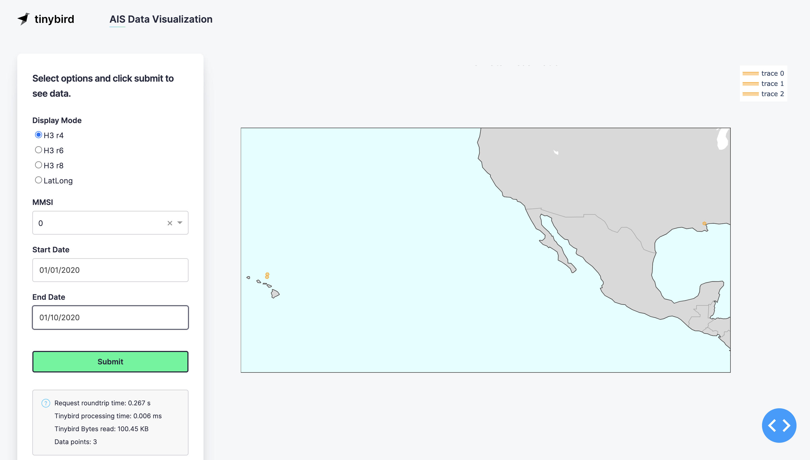

# AIS Demo

This Demo offers a simple exploratory interface over AIS Data.

## Components

The Dashboard is created using [Dash & Plotly](https://dash.plotly.com/) for the map, [Pandas](https://pandas.pydata.org/) for the frontend data processing, and [Tinybird](https://ui.tinybird.co/signup) for the backend.

## Dataset

The dataset comes from [NOAA](https://coast.noaa.gov/htdata/CMSP/AISDataHandler/2020/index.html), and is a few billion vessel observation samples from 2020.

## To Use

1. Clone this repository
2. Create a Python virtual env `python -m venv .venv && ./.venv/bin/activate`
3. Install the Python dependencies `pip install -r requirements.txt`
4. Open or [create](https://www.tinybird.co/docs) your [Tinybird](https://www.tinybird.co/) Workspace
5. Open the [Tinybird Auth Token](https://www.tinybird.co/docs/concepts/auth-tokens) page and copy the User Admin Token
6. In your CLI, run `tb auth` in the repo directory and paste the Auth Token
7. Then run `tb push` to establish the backend processing structure and serve the data APIs
8. Use `noaa_uploader.sh` to append as many of the zipped CSV files as you need to Tinybird for sample data. Jan-May is about 1b rows
> ⚠️ **NOTE:** NOAA provide this data for free, so don't abuse their download server
9. Run `app.py` to have a local Dash app to explore some of the shipping data. The default values should work

You could also stream in live AIS data following the same format.

## Credits
Created by @Chaffelson and @juliavallina
